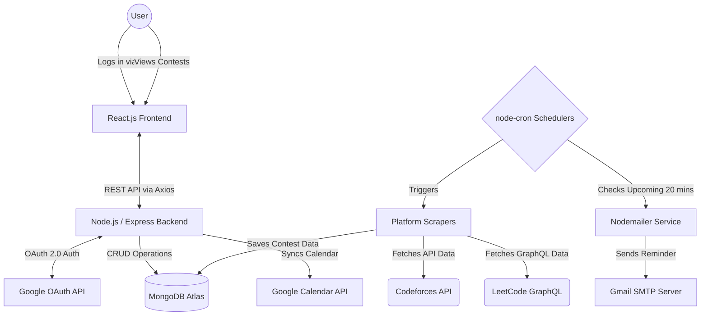

# Contest Alert 🏆

A full-stack web application designed to help competitive programmers track upcoming coding contests across platforms like **Codeforces** and **LeetCode**. With automated tracking, customized filtering, and instant notifications, you will never miss a contest again!


---

## 📖 Table of Contents
- [Project Overview](#-project-overview)
- [System Architecture](#-system-architecture)
- [Key Features](#-key-features)
- [Tech Stack](#-tech-stack)
- [Local Development Setup](#-local-development-setup)
- [Project Structure](#-project-structure)
- [License](#-license)

---

## 🚀 Project Overview
Contest Alert is an intelligent aggregator that bridges the gap between competitive programming platforms and your daily schedule. By pulling data from multiple programming sites, allowing users to filter by specific contest types (like Div. 1, Div. 2, Weekly, Biweekly), and pushing notifications directly to Email and Google Calendar, it acts as your personal competitive programming assistant.

---

## 🏗️ System Architecture

Below is a high-level overview of how the frontend, backend, and external APIs interact in this ecosystem. (GitHub renders this Mermaid diagram automatically!)



---

## ✨ Key Features
- **Automated Scraping & Tracking:** Periodically scrapes Codeforces and LeetCode APIs to keep the database synchronized with real-time contest data.
- **Secure Authentication:** Utilizes Google OAuth 2.0 via Passport.js for a frictionless, password-less 1-click login experience.
- **Granular Custom Filters:** Users can subscribe to specific sub-types of contests instead of all of them (e.g., opting only for LeetCode Biweekly and Codeforces Div 2).
- **Automated Email Reminders:** A background cron job checks for upcoming subscribed contests and dispatches an email reminder precisely 20 minutes before it starts.
- **Google Calendar Sync:** Push upcoming contests directly into your personal Google Calendar with a single click.
- **Persistent Preferences:** User dashboard saves UI themes (Dark/Light mode) and platform preferences securely to MongoDB.

---

## 🛠️ Tech Stack

### Frontend
- **Framework:** React 18
- **Routing:** React Router v6
- **Styling:** Tailwind CSS
- **HTTP Client:** Axios

### Backend
- **Runtime:** Node.js (v18+)
- **Framework:** Express.js
- **Authentication:** Passport.js (Google OAuth 2.0 Strategy)
- **Database ORM:** Mongoose
- **Background Tasks:** `node-cron`
- **Email Service:** Nodemailer

### Infrastructure & External APIs
- **Database:** MongoDB Atlas (Cloud NoSQL)
- **APIs:** Codeforces API, LeetCode GraphQL, Google Calendar API

---

## 💻 Local Development Setup

To run this project locally on your machine, follow these steps carefully.

### Prerequisites
- Node.js installed on your machine
- A MongoDB Atlas connection string (or local MongoDB)
- Google Cloud OAuth Credentials (Client ID and Secret)
- A Gmail App Password (for Nodemailer)

### 1. Clone the Repository
```bash
git clone https://github.com/choudharysaransh54-alt/Contest-Alert.git
cd Contest-Alert
```

### 2. Install Dependencies
You need to install npm packages for both the client and the server.
```bash
# Install frontend dependencies
cd frontend
npm install

# Install backend dependencies
cd ../backend
npm install
```

### 3. Environment Variables
You must create a `.env` file in **both** the `frontend` and `backend` folders. 
*Use the provided `.env.example` files as a template.*

**Backend `.env` example:**
```env
PORT=5001
GOOGLE_CLIENT_ID=your_google_client_id
GOOGLE_CLIENT_SECRET=your_google_client_secret
SESSION_SECRET=a_random_secure_string
EMAIL_USER=your_gmail_address
EMAIL_PASS=your_gmail_app_password
MONGODB_URI=your_mongodb_connection_string
REACT_APP_BACKEND_URL=http://localhost:5001
REACT_APP_FRONTEND_URL=http://localhost:3000
```

### 4. Start the Application
Run both the frontend and backend servers.

```bash
# Start backend server (runs on port 5001 by default)
cd backend
npm start

# In a new terminal tab, start frontend server (runs on port 3000)
cd frontend
npm start
```

---

## 📂 Project Structure

```text
Contest-Alert/
├── backend/
│   ├── server.js                 # Entry point, initializes middleware and DB connection
│   ├── src/
│   │   ├── config/               # Passport.js and database configurations
│   │   ├── controllers/          # Route logic (Auth, Users, Contests)
│   │   ├── cron/                 # Cron jobs for scraping and email reminders
│   │   ├── routes/               # Express API routers
│   │   ├── schemas/              # Mongoose DB Models
│   │   └── services/             # External services (Scrapers, Calendar, Email)
│   └── package.json
└── frontend/
    ├── src/
    │   ├── assets/               # Static images and icons
    │   ├── components/           # Reusable React components (Navbar, Cards, etc.)
    │   ├── pages/                # Main view components (Home, Dashboard, Settings)
    │   ├── services/             # Axios API integration
    │   └── App.js                # React Router setup
    ├── public/
    └── package.json
```

---

## 📄 License
This project is licensed under the MIT License.
